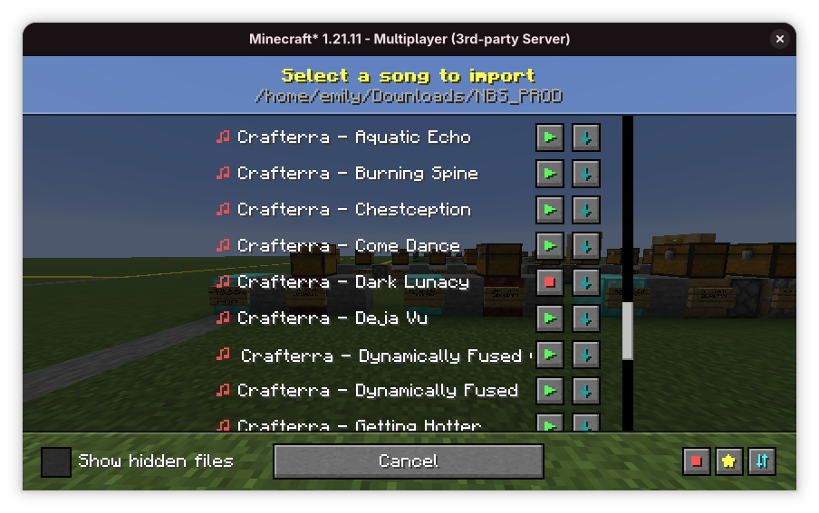

# nbs3df
:sparkles: nbs3df is an open source mod for converting Noteblock Studio songs into 
DiamondFire Code Templates.

It features:
- Song previews, so you don't need to import the song or open Note Block Studio 
- A smaller and more efficient music player (compared to previous players)
- An interactive file explorer to find NBS files on your system.
## How to use?
- Use `/nbs import` to open the interactive import menu and grab a music function
- Run `/nbs player` to grab a music player function
- To play music, call the music function followed by the music player function and music
should begin to play.